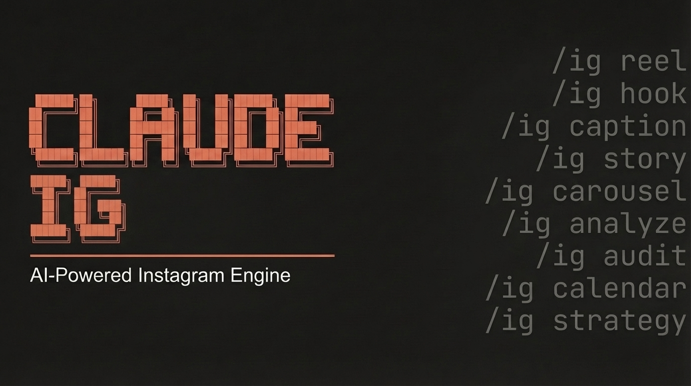

# claude-ig




**The most comprehensive Instagram content engine for Claude Code.**

Full-lifecycle Instagram management: hooks, Reels, Stories, Carousels, captions, affiliate content, performance analysis, competitor research, editorial calendars, and cross-platform repurposing. 13 sub-skills, 6 specialized agents, and a 5-category 100-point scoring system optimized for the 2026 Instagram algorithm.

Works with any Instagram account and niche. Automatic niche detection adapts hook patterns, caption voice, CTA strategy, and content mix recommendations to your specific audience.

## Quick Start

**One-command install (Unix/macOS):**

```bash
curl -fsSL https://raw.githubusercontent.com/NicoJunk/claude-ig/main/install.sh | bash
```

**Or clone and install manually:**

```bash
git clone https://github.com/NicoJunk/claude-ig.git
cd claude-ig
chmod +x install.sh && ./install.sh
```

Restart Claude Code after installation to activate.

## Commands

| Command | Description |
|---------|-------------|
| `/ig reel <topic>` | Write a complete Reel (hook, script, caption, thumbnail) |
| `/ig hook <topic>` | Generate and score hooks for any format |
| `/ig caption <topic>` | Write optimized caption (500+ chars, save CTA) |
| `/ig story <topic>` | Plan Story sequence (slides, stickers, polls) |
| `/ig carousel <topic>` | Plan Carousel (cover, slides, CTA) |
| `/ig analyze [post-url]` | Analyze post performance via Instagram API |
| `/ig audit` | Full content audit with parallel subagent delegation |
| `/ig competitor <accounts>` | Research competitor content |
| `/ig calendar [weekly\|monthly]` | Generate editorial content calendar |
| `/ig strategy` | Content strategy and positioning analysis |
| `/ig affiliate <partner>` | Create compliant affiliate content |
| `/ig comment` | Comment response strategy |
| `/ig repurpose <post>` | Cross-platform repurposing |

## Features

### Niche Detection

Automatically detects your niche from bio, content patterns, and hashtag analysis. Adapts hook selection, caption voice, CTA strategy, and content mix for:

- **Fitness**: Correction hooks, body-part targeting, safe exercise form
- **Food / Nutrition**: Recipe formats, ingredient lists, macro data
- **Beauty / Skincare**: Transformation hooks, product comparison carousels
- **Business / Coaching**: Authority hooks, case study carousels, lead magnet CTAs
- **Education**: Curiosity gap hooks, carousel-heavy strategy
- **Lifestyle**: Identity trigger hooks, story-heavy strategy
- **Creator**: Analyzes top posts to determine primary content type

### 5-Category Quality Scoring (100 Points)

| Category | Points | Focus |
|----------|--------|-------|
| Hook Strength | 25 | Curiosity gap, pattern interrupt, first 3s clarity |
| Content Quality | 25 | Value density, structure, voice authenticity |
| Caption & CTA | 20 | Length, CTA type, opener, hashtags |
| Format Compliance | 15 | Specs, safe zones, thumbnail, duration |
| Algorithm Signals | 15 | Save/DM optimization, originality, watch time |

Scoring bands: Publish (90-100), Strong (80-89), OK (60-79), Below Standard (40-59), Reject (<40).

Content scoring below 80 includes specific revision instructions per deficient category.

### 7 Quality Gates (Zero Tolerance)

| Gate | Rule |
|------|------|
| G1 | Never deliver content without a score |
| G2 | Never use em dashes |
| G3 | Never create affiliate content without disclosure |
| G4 | Never recommend controversial opinion posts |
| G5 | Never place 2 affiliate posts on consecutive days |
| G6 | Never guess account metrics |
| G7 | Never place text in unsafe zones |

### 2026 Algorithm Optimization

Every piece of content is optimized in this priority order:

1. **Watch Time** (5-8x weight vs likes) - First 3 seconds determine distribution
2. **DM-Sends** (3-5x weight) - Primary signal for reaching new audiences
3. **Saves** (~3x weight) - Signal for lasting value
4. **Likes/Comments** (1x baseline) - Weakest signals
5. **Originality Score** - Recycled formats tank reach

### Parallel Audit Engine

`/ig audit` spawns 6 specialized agents simultaneously:

| Agent | Focus |
|-------|-------|
| Content | Quality scoring across recent posts |
| Engagement | Save rates, DM-send rates, completion rates |
| Creative | Format compliance, safe zones, thumbnails |
| Growth | Follower growth, reach trends, posting frequency |
| Competitor | Competitive benchmarking and gap analysis |
| Compliance | Affiliate disclosure, Quality Gate adherence |

### Scripts

| Script | Purpose |
|--------|---------|
| `analyze_post.py` | Post performance analysis (Graph API + Apify fallback) |
| `score_content.py` | Offline content quality scoring (5-category rubric) |

## Architecture

```
claude-ig/
├── skills/
│   ├── ig/                            # Main orchestrator
│   │   ├── SKILL.md                   # Command routing, quality gates, scoring
│   │   └── references/                # 12 on-demand reference docs
│   │       ├── algorithm-2026.md      # Algorithm signals and ranking factors
│   │       ├── scoring-system.md      # 100-point rubric with sub-criteria
│   │       ├── format-specs.md        # Technical specs per format
│   │       ├── hook-library.md        # 50+ hook templates, 5 categories
│   │       ├── content-rules.md       # Caption structure, CTA hierarchy
│   │       ├── account-baseline.md    # Account metrics template
│   │       ├── affiliate-compliance.md # Partner rules, legal compliance
│   │       ├── conversion-pipeline.md # DM automation, UTMs, funnels
│   │       ├── competitor-framework.md # Monitoring, benchmarks, trends
│   │       ├── story-strategy.md      # Story types, retention, interactives
│   │       ├── comment-responder.md   # Comment automation, voice rules
│   │       └── repurpose-playbook.md  # Cross-platform adaptation
│   ├── ig-reel/SKILL.md              # Full Reel production
│   ├── ig-hook/SKILL.md              # Hook generation and scoring
│   ├── ig-caption/SKILL.md           # Caption writing
│   ├── ig-story/SKILL.md            # Story sequence planning
│   ├── ig-carousel/SKILL.md         # Carousel planning
│   ├── ig-analyze/SKILL.md          # API-driven analysis
│   ├── ig-audit/SKILL.md            # Full audit (spawns 6 agents)
│   ├── ig-competitor/SKILL.md       # Competitor research
│   ├── ig-calendar/SKILL.md         # Editorial calendars
│   ├── ig-strategy/SKILL.md         # Content strategy
│   ├── ig-affiliate/SKILL.md        # Affiliate content
│   ├── ig-comment/SKILL.md          # Comment responses
│   └── ig-repurpose/SKILL.md        # Cross-platform repurposing
├── agents/                           # 6 specialized agents
│   ├── ig-content.md
│   ├── ig-engagement.md
│   ├── ig-creative.md
│   ├── ig-growth.md
│   ├── ig-competitor.md
│   └── ig-compliance.md
├── scripts/
│   ├── analyze_post.py               # Post performance analysis
│   └── score_content.py              # Offline content quality scoring
├── docs/
│   ├── ARCHITECTURE.md               # System design and patterns
│   ├── COMMANDS.md                   # Command reference with examples
│   └── INSTALLATION.md              # Setup guide
├── install.sh                        # Unix/macOS installer
├── uninstall.sh                      # Clean uninstaller
├── requirements.txt                  # Python dependencies
├── CHANGELOG.md
├── LICENSE
└── README.md
```

## Requirements

- [Claude Code](https://docs.anthropic.com/en/docs/claude-code) CLI installed and configured
- Python 3.12+ (for analysis scripts)
- Instagram API access (Graph API token or Apify token) for live data analysis
- Optional: `pip install -r requirements.txt` for full script functionality

## Setup

After installation, configure for your account:

1. **Set API credentials** in your environment:
   ```bash
   export INSTAGRAM_ACCESS_TOKEN="your-token"
   export INSTAGRAM_USER_ID="your-user-id"
   # Or for Apify fallback:
   export APIFY_TOKEN="your-apify-token"
   ```

2. **Run `/ig analyze`** to populate account baseline data
3. **Run `/ig audit`** to establish baseline scores
4. **Customize `references/account-baseline.md`** with your account metrics

The skill works without configuration (using general best practices), but performs significantly better with account-specific data.

## Integration

**Optional companion skills** (for deeper research):

| Skill | Integration |
|-------|-------------|
| `ig-research` | Apify scraping, outlier detection |
| `video-analyzer` | Gemini video analysis |
| `content-strategie` | Macro-level batch planning |

## Uninstall

```bash
chmod +x uninstall.sh && ./uninstall.sh
```

## Documentation

Detailed documentation is available in [docs/](docs/):

- [Installation Guide](docs/INSTALLATION.md) - Setup for Unix, macOS, manual install
- [Command Reference](docs/COMMANDS.md) - Full 13-command reference with examples
- [Architecture](docs/ARCHITECTURE.md) - System design and component overview

## Contributing

Contributions welcome! Please open an issue or pull request.

## License

MIT License. See [LICENSE](LICENSE) for details.

---

Built by [NicoJunk](https://github.com/NicoJunk) with Claude Code.
